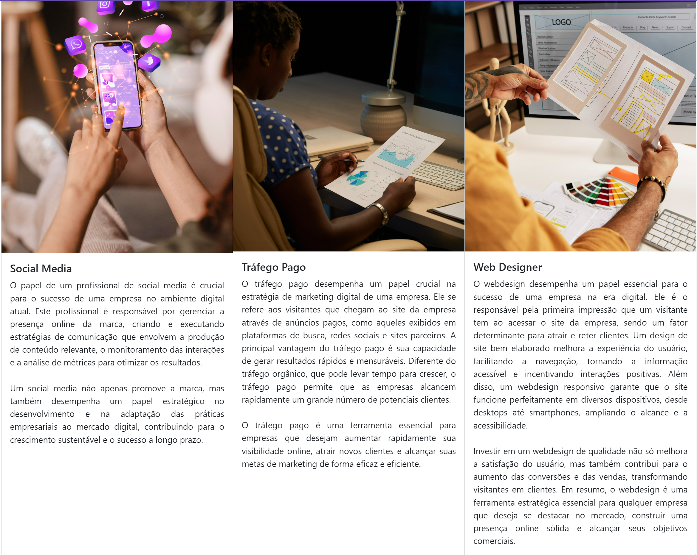

Desafio 15
Crie um projeto utilizando 4 elementos ou componentes do bootstrap.

nav bar →  https://getbootstrap.com/docs/5.3/components/navbar/

card (quote) → https://getbootstrap.com/docs/5.3/components/card/

carrousel (Autoplaying carousels without controls) → https://getbootstrap.com/docs/5.3/components/carousel/ 

card → https://getbootstrap.com/docs/5.3/components/card/

footer → https://getbootstrap.com/docs/5.3/examples/footers/ 

